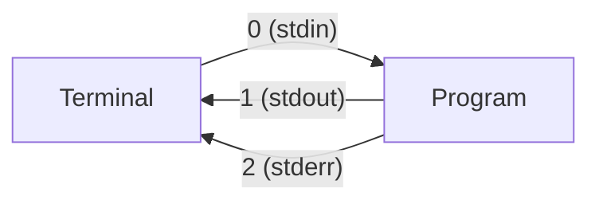
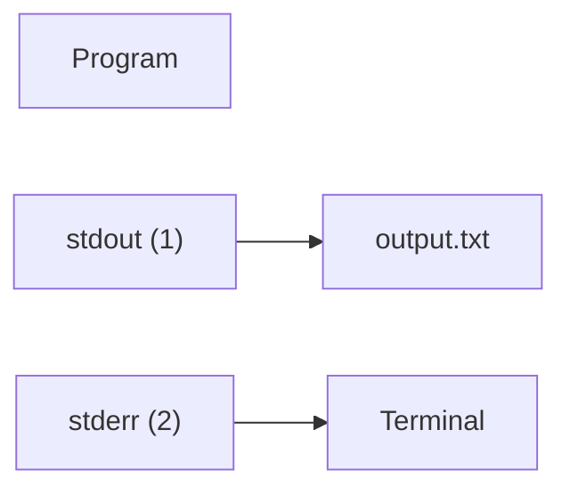
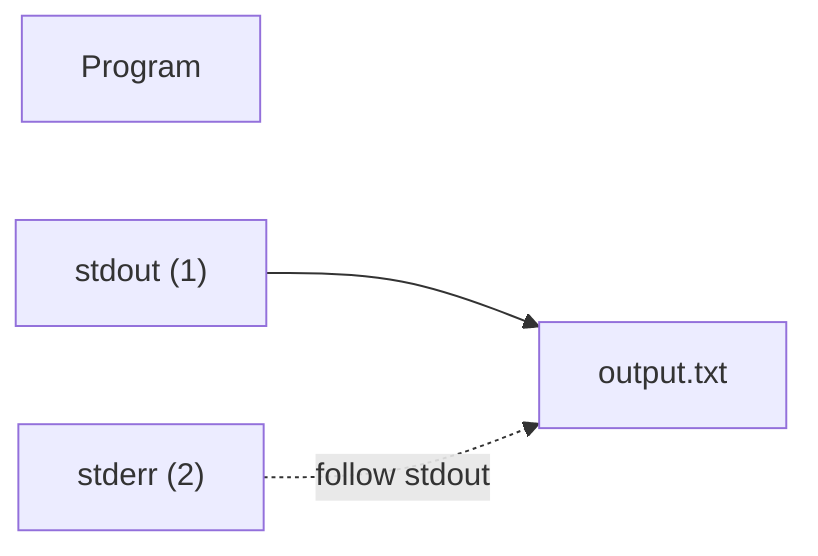

---
Understanding `2>&1` in 3 Minutes

By Niketan Rane | June 2026 | 3 min read

---

Every now and then something fails inside the Copilot CLI (or any other agent harness, really), and the fix-it instructions always look something like:

```bash
command > output.log 2>&1
```

I've copied that around for months without really knowing what it meant. I knew it sent the outputs somewhere for the agent to debug. I knew the `2>&1` came into picture only in case something went wrong. Today, while staring at yet another debug-log instruction, I finally sat down to understand it and it is much simpler than it looks.

---

Every program has three standard streams

Before any of the syntax makes sense, you have to know about these three:

| File Descriptor | Name   | Purpose       |
| --------------- | ------ | ------------- |
| `0`             | stdin  | Input         |
| `1`             | stdout | Normal output |
| `2`             | stderr | Error output  |

By default, both `stdout` and `stderr` end up printed to your terminal, which is why we don't usually think about them as separate things. Under the hood, the shell treats each of them like a file you can read from or write to. That's why they have file descriptor numbers in the first place. Redirection is really just the shell rewiring which "file" each descriptor points at before your program runs.



---

`>` is just shorthand for `1>`

These two commands do exactly the same thing:

```bash
command > output.txt
```

```bash
command 1> output.txt
```

The shell assumes you meant file descriptor `1` (stdout) if you don't say otherwise.



Notice that stderr is still going to the terminal. The `>` only redirected stdout.

---

So what does `2>&1` actually mean?

```text
2>     Redirect stderr
&1     ...to wherever stdout is currently going
```
So `2>&1` doesn't reference a file at all. It just says: **Make stderr follow stdout.**

When you put it all together:

```bash
command > output.txt 2>&1
```

stdout gets pointed at `output.txt`, and then stderr is told to go to the same place stdout is pointing to. Both end up in the file.


---

What if I want errors in their own file?

This sends normal output to one file and errors to another:

```bash
command 1> output.txt 2> errors.txt
```

---

And if you don't care about the output at all

Linux has a special file called `/dev/null` that throws away anything written to it. Combine it with what you already know and you get the classic "shut up completely" command:

```bash
command > /dev/null 2>&1
```

stdout goes into the void, and stderr follows it into the void. Useful for cron jobs, background tasks, and any command whose output you genuinely never want to see.

---

That's it
Three minutes of attention saved me from another year of copy-pasting (or nowadays supervising) something I didn't understand. Hopefully it does the same for you.
